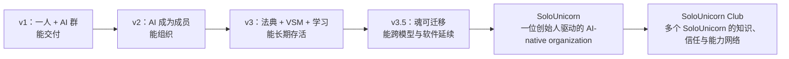

# 从薄壳公司到 SoloUnicorn：AI-native 一人公司的理论基础

> 研究对象：`/Users/jesseqin/dev/tsc` 仓库中的 v1.0、v2.0、v3.0、v3.5《魂》，以及 v3.5 明确指定的配套实现文档《壳》。
>
> 说明：本文严格区分三种内容：**【原文主张】**是仓库白皮书明确提出的观点；**【版本演化】**是对四版文本的比较；**【综合推论】**是把 TSC 理论重构为 Jesse Qin 的 One-Person Company / SoloUnicorn 与 SoloUnicorn Club 理论，不能反向当作白皮书原话。

## 结论摘要

SoloUnicorn 不应被定义成“一个人用了很多 AI 工具”，而应被定义成：

> **由一位人类创始人持有意图主权、最终判断与不可逆责任，以 AI Agent 作为持续运行的主要执行成员，以可迁移的组织记忆和判断法典作为长期资产，并能按任务动态接入外部个人、团队、公司与组织的 AI-native organization。**

这个定义来自四版白皮书的累积，而不是其中任何单一版本：

- v1 给出一人公司最直接的组织原语：`1 人 + AI 群`，人负责意图与判断，Agent 负责执行，知识库形成护城河。原文还明确把最小运营团队写为“1人+AI群”，把最小启动单元写为“一名编排者 + 大模型 + 任务管理 + 知识库 + 收款能力 + 明确意图”。（来源：`/Users/jesseqin/dev/tsc/whitepaper/v1.0/whitepaper-v1.0-full.md:L359-L378`，§3.1；同文件 `L444-L455`，§3.4；`L1365-L1386`，§9.1）
- v2 把 AI 从工具提升为有角色、职责、自主边界和持续状态的组织成员，并正式命名“个人 + Agent 群（超级个体）”拓扑。（来源：`/Users/jesseqin/dev/tsc/whitepaper/v2.0/whitepaper-v2.0-full.md:L324-L358`，§2.5；同文件 `L868-L888`，§10 形态一）
- v3 把轻量执行结构升级为可长期存活、自我学习、自我修复和递归扩展的组织系统，引入自创生、VSM、法典、进化博弈、知识公地与分叉机制。（来源：`/Users/jesseqin/dev/tsc/whitepaper/v3.0/whitepaper-v3.0-full.md:L16-L46`，序言；同文件 `L148-L216`，§1；`L1363-L1402`，§28）
- v3.5 把组织的长期资产从“人和软件”中抽离出来，定义为可迁移的“魂”：创世承诺、判断法典、事件流、校准记忆；壳则是可替换的内核、模块、Agent 与技能。它直接把全部赌注明确表述为“一个人驱动一个大组织”。（来源：`/Users/jesseqin/dev/tsc/whitepaper/TSC-3.5-白皮书-魂.md:L11-L35`，总纲）

因此，SoloUnicorn 的“独角兽”不应只指估值，而应先指一种新的组织能力：**一个人的战略判断，通过可持续、可学习、可复制的数字组织，被放大到传统上需要多人公司的产出与适应能力。**【综合推论】商业估值可以是结果，但不是定义成立的前提。

## 一、白皮书明确提出了什么

### 1. 经济基础：AI 改写了公司的最优边界

**【原文主张】** v2 用科斯交易成本框架解释 TSC：公司之所以扩张，是因为内部协调曾经比外部交易便宜；AI 同时降低执行、协调和操作信任成本，因此组织的最优规模向“更小、更动态、更异构”收缩。（来源：`/Users/jesseqin/dev/tsc/whitepaper/v2.0/whitepaper-v2.0-full.md:L96-L134`，§1.1–1.2）

这为一人公司提供的不是“AI 很强”式的技术乐观，而是组织经济学论证：

1. 标准化认知执行从工资、管理和沟通成本，转化为可计量的算力成本；
2. 多 Agent 的协调可由自然语言理解、任务分解、状态追踪和异常报警承担；
3. 可验证记录、标准化能力评估与声誉机制可以减少陌生协作的信任摩擦。

白皮书据此推导成员不再由雇佣身份定义，而由贡献能力定义；成员之间更接近协议关系而非从属关系，异构协作依赖共同接口与协议。（来源：`/Users/jesseqin/dev/tsc/whitepaper/v2.0/whitepaper-v2.0-full.md:L136-L166`，§1.3–1.4）

**【综合推论】** SoloUnicorn 的核心经济优势不是“完全无人化”，而是把固定人力编制变成三类可变投入：算力、可调用的 Agent 能力、按需接入的外部能力。它追求的应是**每单位创始人注意力创造的价值**，而不只是人均收入。

### 2. 人机分工：人持有意图，AI 承担大部分执行

**【原文主张】** v1 认为执行稀缺正在被意图、判断、人际与创意稀缺取代；人类在 TSC 中保留意图持有、价值判断、关系维护与伦理守门四种角色。（来源：`/Users/jesseqin/dev/tsc/whitepaper/v1.0/whitepaper-v1.0-full.md:L180-L200`，§1.2；同文件 `L960-L986`，§6.4）

v2 将这套分工写成三层协调结构：

- 战略层决定“做什么”，由人类主导；
- 战术层决定“谁做什么”，由战略 Agent 与人类编排者协同；
- 执行层完成任务和追踪进度，大部分由 Agent 自动完成。（来源：`/Users/jesseqin/dev/tsc/whitepaper/v2.0/whitepaper-v2.0-full.md:L514-L571`，§4.2）

治理原则进一步规定：意图主权属于人类，执行自主权属于最有能力的执行者，收益与贡献而非身份挂钩，所有成员保有退出权。（来源：`/Users/jesseqin/dev/tsc/whitepaper/v2.0/whitepaper-v2.0-full.md:L986-L1006`，§11.1）

**【综合推论】** SoloUnicorn 不是创始人退出组织，而是创始人从“亲自做每件事”升级为五个高杠杆职责：

1. 定义值得做的事；
2. 定义什么算好；
3. 决定不可逆事项；
4. 维护关键人际信任；
5. 对组织后果承担最终责任。

### 3. 一人公司的最小拓扑已经在原文中成立

**【原文主张】** v1 的单核 TSC 是 1–5 名人类编排者配合 5–20 个 Agent；流程从意图输入开始，经任务分解、资源匹配、并行执行、质量检查、人类判断、最终交付到结算触发。原文明确把个人判断积累和私有知识库深度称为单核 TSC 的两项护城河。（来源：`/Users/jesseqin/dev/tsc/whitepaper/v1.0/whitepaper-v1.0-full.md:L459-L509`，§4.1）

v2 把这个形态收敛为“一位个人成员 + N 个 Agent”，并明确：Agent 承担几乎全部执行，人类专注意图和判断；同时指出其主要风险是唯一人类成员构成单点故障。（来源：`/Users/jesseqin/dev/tsc/whitepaper/v2.0/whitepaper-v2.0-full.md:L868-L888`，§10 形态一）

**【综合推论】** 可把 SoloUnicorn 的最小结构写成：

```text
SoloUnicorn = 1 位意图主权持有者
            × 1 个可迁移的组织之魂
            × N 个有边界的 Agent 职业
            × 1 套交付—反馈—学习闭环
            × 按需接入的外部能力网络
```

这里的乘法表示任何一项缺失都会让它退化：没有真实交付，只是 AI 实验；没有判断与责任，只是自动化；没有记忆与校准，只是重复提示；没有商业闭环，只是爱好项目。

### 4. Agent 是成员，不只是工具

**【原文主张】** v2 的最大增量是把 Agent 定义为具有自主执行、持续运行和专业知识存储能力的成员。工具等待指令；成员持续监控、发现机会、主动报告并在职责范围内执行。Agent 的核心能力包括 24/7 运行、稳定重复、并发、持续记忆与可复制扩容。（来源：`/Users/jesseqin/dev/tsc/whitepaper/v2.0/whitepaper-v2.0-full.md:L324-L358`，§2.5）

但成员身份不等于无限授权。v2 的边界原则是：可逆决策可交给 AI，不可逆决策必须由人确认；外部承诺、超过阈值的资金流、职责边界修改和未经确认的公开发布均不应由 Agent 自主完成。（来源：`/Users/jesseqin/dev/tsc/whitepaper/v2.0/whitepaper-v2.0-full.md:L402-L422`，§2.5；同文件 `L1008-L1032`，§11.2）

**【综合推论】** “AI employee”只是表层隐喻，更准确的组织单元是**可审计的数字职业**：每个 Agent 应有角色、输入输出契约、权限、预算、质量标准、升级条件和停用条件。

### 5. 一人公司要成为组织，必须拥有可行系统的完整功能

**【原文主张】** v3 用 VSM 将可行组织分为五个递归子系统：

- S1 运营：直接产生价值的执行单元；
- S2 协调：处理接口与资源冲突；
- S3 控制：质量、资源分配、贡献归因与审计；
- S4 适应：监测市场、技术、监管与竞争变化；
- S5 身份：保存组织存在理由和不可违背原则。（来源：`/Users/jesseqin/dev/tsc/whitepaper/v3.0/whitepaper-v3.0-full.md:L222-L287`，§2）

v3.5 将其落成 11 个最小职业，包括创世者、指挥官、哨兵、摄入官、蒸馏师、预言家、简报官、协调员、执行者、归因官/司库和招募官；对一人 TSC，创始人兼任创世者与指挥官，其他职责尽量交给 Agent，遇到真实瓶颈再升级。（来源：`/Users/jesseqin/dev/tsc/whitepaper/TSC-3.5-白皮书-魂.md:L215-L236`，§VSM 必备职业）

**【综合推论】** 判断一个人是否真正建立了 SoloUnicorn，不应数他用了多少工具，而应检查五种组织功能是否完整。一个只有内容生成 Agent、没有市场感知、质量控制、记忆校准和身份边界的系统，不是完整的 AI-native organization。

### 6. 组织的长期资产是“魂”，不是当前模型或软件栈

**【原文主张】** v3.5 定义：

```text
soul  = genesis + judgment_codex + event_stream + calibration_memory
shell = kernel + modules + agents + skills
```

魂与壳应物理分离；只要创世承诺、事件轨迹、判断标准和校准账本连续，模型、软件与团队都可替换，组织仍可保持身份连续性。（来源：`/Users/jesseqin/dev/tsc/whitepaper/TSC-3.5-白皮书-魂.md:L11-L35`，总纲；同文件 `L288-L300`，§复活）

配套《壳》把这一思想落为稳定接口、可替换模块、自创生引擎和独立 `soul/` 目录，并规定仅凭魂即可重算当前属性。（来源：`/Users/jesseqin/dev/tsc/whitepaper/OpenTSC-v1.0-壳-设计理念与技术实现.md:L22-L38`，§1；同文件 `L42-L96`，§2–3；`L145-L158`，内核不变量）

**【综合推论】** SoloUnicorn 的真正复利资产不是“某个最好用的模型”，而是：

- 创始人显式化的判断标准；
- 带来源与结果的事件历史；
- 哪些预测正确、哪些判断失误的校准记录；
- 可复用工作流、客户语境和领域知识；
- 经过真实交付验证的 Agent 职业与接口。

### 7. 知识库不是资料仓库，而是判断与学习系统

**【原文主张】** v3.5 要求事件流只追加不覆盖、证据先于判断、自动提取先进入草案；属性只能由事件和判断法典推导，并携带证据、置信度、复审时间和衰减。（来源：`/Users/jesseqin/dev/tsc/whitepaper/TSC-3.5-白皮书-魂.md:L66-L104`，法则四至九）

它还把规则法典与判断法典分开：前者规定允许与禁止，后者规定什么算好、谁可信、什么值得调用；系统必须用现实结果校准，而不能用“是否让创始人舒服”作为学习信号。（来源：`/Users/jesseqin/dev/tsc/whitepaper/TSC-3.5-白皮书-魂.md:L86-L98`，法则七至八）

**【综合推论】** SoloUnicorn 的知识操作系统至少应区分四层：

1. 原始材料；
2. 待确认事实；
3. 有证据的事件和关系；
4. 经现实结果校准的判断与可执行知识。

这能避免把“大量文档”误当成“组织智慧”。

### 8. 自我进化不是无限自动化，而是受约束的反馈循环

**【原文主张】** v3 的四重自创生包括规则、成员机制、目标和边界的自我更新，但前提是内部状态可观测、变化能触发响应、响应有反馈循环，且创世核心不可被日常自我修改。（来源：`/Users/jesseqin/dev/tsc/whitepaper/v3.0/whitepaper-v3.0-full.md:L166-L206`，§1.2–1.3）

v3.5 将其进一步压缩成“可观测 → 触发响应 → 反馈闭环 → 不碰创世核心”，并要求新 Agent 或技能只在已证实的能力缺口出现时生成。（来源：`/Users/jesseqin/dev/tsc/whitepaper/TSC-3.5-白皮书-魂.md:L108-L128`，法则十至十二）

《壳》将这一原则实现为草案、校验、玩家批准、注册和日落流程，明确禁止新 Agent 自动激活。（来源：`/Users/jesseqin/dev/tsc/whitepaper/OpenTSC-v1.0-壳-设计理念与技术实现.md:L196-L231`，§5）

**【综合推论】** SoloUnicorn 的扩张单位不是 headcount，而是**经验证的能力缺口**。先用最小系统交付；只有重复瓶颈被证实时，才新增 Agent、技能或外部成员。

### 9. 社群是生产与信任基础设施

**【原文主张】** v1 认为社群不是营销渠道，而是协作、决策、执行、复盘和知识积累发生的组织界面；社会层需要心理契约、关系与情绪设计。（来源：`/Users/jesseqin/dev/tsc/whitepaper/v1.0/whitepaper-v1.0-full.md:L673-L730`，§5.1–5.2；同文件 `L755-L805`，§5.4）

v2 在 AI 成员增加后仍坚持社会层不可缺失，并要求心理契约明文化、情绪有出口、贡献被看见、失败可以说。（来源：`/Users/jesseqin/dev/tsc/whitepaper/v2.0/whitepaper-v2.0-full.md:L1194-L1234`，§15）

v3 则把多样性、交互密度和简单规则视为涌现集体智慧的条件，并称社会层是涌现的基础设施。（来源：`/Users/jesseqin/dev/tsc/whitepaper/v3.0/whitepaper-v3.0-full.md:L291-L333`，§3.1–3.2）

**【综合推论】** SoloUnicorn Club 的价值不能只停留在内容、活动和人脉；它应该成为成员一人公司的信任层、学习层与能力组合层。

## 二、四个版本如何演化

| 版本 | 核心问题 | 明确新增 | 对 SoloUnicorn 的意义 |
|---|---|---|---|
| v1 | 轻量 AI 组织如何启动和交付？ | 意图层、AI 执行、人类编排、社会层、支付、单核/嵌套/大脑-手脚三种形态、MSU | 证明“一人 + AI 群”是最小公司原语，而不是个人生产力技巧。（来源：`/Users/jesseqin/dev/tsc/whitepaper/v1.0/whitepaper-v1.0-full.md:L359-L378`，§3.1；`L459-L509`，§4.1） |
| v2 | 当成员不只是人，组织如何定义？ | 五类异构成员、Agent 成员、三层协调、七种拓扑、贡献归因、算力预算 | 把 AI 从工具变成有职责与边界的数字同事，并给出“超级个体”拓扑。（来源：`/Users/jesseqin/dev/tsc/whitepaper/v2.0/whitepaper-v2.0-full.md:L324-L358`，§2.5；`L426-L455`，§3.1；`L868-L888`，§10） |
| v3 | 组织如何超越创始人上限并长期存活？ | 自创生、VSM、涌现、法典、贡献治理、递归 TSC、烙印、组织学习、知识公地、防腐化与分叉 | 让 SoloUnicorn 从短期高杠杆个体升级为会学习、可治理、可递归扩展的生命系统。（来源：`/Users/jesseqin/dev/tsc/whitepaper/v3.0/whitepaper-v3.0-full.md:L16-L46`，序言；`L1363-L1402`，§28） |
| v3.5 | 如何让组织智慧脱离创始人脑袋和具体软件而存活？ | 魂壳分离、十二法则、双法典、事件推导属性、现实校准、职业/玩家/NPC 本体、创世七问、复活 | 定义可移植的“一人公司组织操作系统”，同时保护人类意图主权。（来源：`/Users/jesseqin/dev/tsc/whitepaper/TSC-3.5-白皮书-魂.md:L11-L35`，总纲；`L40-L130`，十二法则；`L304-L314`，增量附录） |

整体演化可以概括为：



## 三、SoloUnicorn 理论：建议采用的正式表述

以下均为**【综合推论】**，是对原白皮书的重构，不是逐字摘录。

### 3.1 定义

**SoloUnicorn（一人独角兽）是一种 AI-native organization，而不是一个人硬撑的微型传统公司。**

它由一个人持有组织的“为什么”和“什么算好”，由一组有明确职业、权限和预算的 Agent 承担可逆、可验证、可重复的执行，通过事件、知识和校准持续学习，并在需要牌照、关系、资产或新能力时，以协议形式临时接入外部成员。

### 3.2 六条理论支柱

1. **意图主权（Intent Sovereignty）**：创始人决定为什么做、做到什么算好、何时停止。来源基础是 v1 的人类四角色与 v2 的治理原则。（来源：`/Users/jesseqin/dev/tsc/whitepaper/v1.0/whitepaper-v1.0-full.md:L960-L986`，§6.4；`/Users/jesseqin/dev/tsc/whitepaper/v2.0/whitepaper-v2.0-full.md:L986-L1006`，§11.1）
2. **执行资本（Agentic Execution Capital）**：Agent 不只是工具列表，而是拥有职业契约、持续状态、预算与绩效记录的可复用执行资本。（来源：`/Users/jesseqin/dev/tsc/whitepaper/v2.0/whitepaper-v2.0-full.md:L324-L400`，§2.5）
3. **判断资本（Judgment Capital）**：创始人的判断被写入判断法典，并通过现实结果校准，逐步从个人直觉变成组织资产。（来源：`/Users/jesseqin/dev/tsc/whitepaper/TSC-3.5-白皮书-魂.md:L86-L104`，法则七至九）
4. **可变边界（Elastic Boundary）**：公司不是固定员工集合，而是围绕任务动态组合个人、团队、公司、组织和 Agent 的协议网络。（来源：`/Users/jesseqin/dev/tsc/whitepaper/v2.0/whitepaper-v2.0-full.md:L148-L166`，§1.4；同文件 `L435-L455`，§3.1）
5. **组织复利（Organizational Compounding）**：每次交付沉淀事件、SOP、客户语境、预测结果与判断校准，使后续 Agent 和创始人都更强。v3 将人类学习与 Agent 学习描述成“双螺旋上升”。（来源：`/Users/jesseqin/dev/tsc/whitepaper/v3.0/whitepaper-v3.0-full.md:L1029-L1062`，§21）
6. **可迁移身份（Portable Organizational Identity）**：组织身份由创世核心与连续记忆保持，而不依赖当前模型、工具或团队。（来源：`/Users/jesseqin/dev/tsc/whitepaper/v3.0/whitepaper-v3.0-full.md:L208-L218`，§1.4；`/Users/jesseqin/dev/tsc/whitepaper/TSC-3.5-白皮书-魂.md:L288-L300`，§复活）

### 3.3 不是 SoloUnicorn 的情况

- 一个人订阅了许多 AI 工具，但任务、数据和判断没有连接；
- 有自动生成内容或代码，却没有真实客户、收入或价值验证；
- Agent 可以执行，却没有权限边界、日志、质量门和人类问责；
- 每次任务仍从零开始，没有事件、SOP、知识和校准积累；
- 创始人仍是所有环节的人工瓶颈，只是把部分打字工作交给 AI；
- 以“无人公司”为卖点，把意图、伦理和不可逆责任也交给模型。

这些边界与 v1 对“不是外包公司、不是 DAO、不是自由职业者协会、不是 AI 工具集合”的排除逻辑一致。（来源：`/Users/jesseqin/dev/tsc/whitepaper/v1.0/whitepaper-v1.0-full.md:L430-L442`，§3.3）

### 3.4 成熟度阶梯

| 阶段 | 组织状态 | 通过标准 |
|---|---|---|
| L0 AI 使用者 | 零散使用 AI | 只提升个人任务效率，不算 SoloUnicorn |
| L1 AI 工作流 | 有可重复 SOP | 能稳定完成一种真实交付 |
| L2 Agent 组织 | 有角色、边界、预算、质量门 | 多个执行职业可持续运行，创始人只在关键点介入 |
| L3 学习型 SoloUnicorn | 有事件流、知识库、判断法典、校准闭环 | 同类任务质量或速度随交付次数改善 |
| L4 可进化 SoloUnicorn | 能发现能力缺口并安全新增/替换 Agent | 组织按需求生长，不靠提前堆架构 |
| L5 生态型 SoloUnicorn | 能作为一个能力节点与其他 TSC 递归组合 | 可加入更大项目并保持自身身份、接口与声誉 |

该阶梯是【综合推论】；其理论基础分别来自 v1 的 MSU 和交付闭环、v2 的 Agent 成员与递归成员、v3 的自创生和 TSC^n、v3.5 的魂壳与缺口驱动生长。（来源：`/Users/jesseqin/dev/tsc/whitepaper/v1.0/whitepaper-v1.0-full.md:L1365-L1386`，§9.1；`/Users/jesseqin/dev/tsc/whitepaper/v2.0/whitepaper-v2.0-full.md:L324-L358`，§2.5；`/Users/jesseqin/dev/tsc/whitepaper/v3.0/whitepaper-v3.0-full.md:L909-L968`，§16；`/Users/jesseqin/dev/tsc/whitepaper/TSC-3.5-白皮书-魂.md:L108-L130`，法则十至十二）

## 四、SoloUnicorn Club 的理论定位

以下均为**【综合推论】**。

### 4.1 Club 不是普通创业社群，而是 TSC 生态层

v1 描述了从单核 TSC、临时联合体、稳定集群到生态平台的四层结构，并提出能力市场、声誉系统和知识积累机制。（来源：`/Users/jesseqin/dev/tsc/whitepaper/v1.0/whitepaper-v1.0-full.md:L1692-L1768`，§11.1–11.4）

v3 又定义知识公地为所有 TSC 可贡献和使用的长期记忆，同时区分可共享的基础方法、失败案例、工具评测，与应私有保留的客户洞见、专有方法和模型。（来源：`/Users/jesseqin/dev/tsc/whitepaper/v3.0/whitepaper-v3.0-full.md:L1197-L1246`，§24）

据此，SoloUnicorn Club 应承担四项基础设施功能：

1. **学习基础设施**：把共同方法、模板、失败案例和工具评测沉淀为知识公地；
2. **能力基础设施**：维护成员和 Agent 的可验证能力名片，支持任务匹配；
3. **信任基础设施**：基于真实交付维护多维、可衰减、可申诉的声誉；
4. **组合基础设施**：让多个 SoloUnicorn 能围绕大项目临时组成更高层 TSC，项目结束后恢复独立。

### 4.2 Club 本身可以是一个递归 TSC

v3 将 `TSC⁰` 定义为基础单元，将含有子 TSC 的组织定义为 `TSC¹...TSCⁿ`，并要求子 TSC 保持内部自治、接口约定、退出自由和独立声誉。（来源：`/Users/jesseqin/dev/tsc/whitepaper/v3.0/whitepaper-v3.0-full.md:L909-L968`，§16）

因此可以把 Club 设计为：

```text
成员 SoloUnicorn = TSC⁰
SoloUnicorn Club  = TSC¹
跨城市/跨行业俱乐部网络 = TSC²
```

Club 不管理成员公司的内部，而只提供共同接口：知识、公信力、需求、匹配、协作协议、争议解决和必要的结算支持。

### 4.3 Club 的会员旅程应从“创业课程”改成“组织孵化”

建议路径：

1. **Genesis Workshop**：写清存在宣言、底线、目标、玩家、环境、判断种子、资源边界和预期成员；直接对应 v3.5 创世七问。（来源：`/Users/jesseqin/dev/tsc/whitepaper/TSC-3.5-白皮书-魂.md:L240-L268`，§创世清单）
2. **48-hour MVT**：用真实低风险任务建立第一个战略 Agent、1–3 个专业 Agent、知识结构和首个 SOP。（来源：`/Users/jesseqin/dev/tsc/whitepaper/v2.0/whitepaper-v2.0-full.md:L1350-L1377`，§17.3）
3. **First Revenue / First Delivery**：必须完成真实价值交换，防止长期停留在工具配置阶段；v1 的启动手册强调真实测试、真实交付和立即复盘。（来源：`/Users/jesseqin/dev/tsc/whitepaper/v1.0/whitepaper-v1.0-full.md:L1442-L1526`，§9.3–9.5）
4. **Codify the Company**：把交付中的事实、判断、SOP、质量标准和权限写进魂，而不是只保留在创始人脑中。
5. **Calibration Loop**：记录预测和结果、复盘判断错误、更新判断法典；这是组织从“会做事”变成“会学习”的门槛。（来源：`/Users/jesseqin/dev/tsc/whitepaper/TSC-3.5-白皮书-魂.md:L94-L104`，法则八至九）
6. **Capability Market**：出现真实能力缺口时，先在 Club 内匹配 Agent、专家、公司或其他 SoloUnicorn，再决定是否招聘。（来源：`/Users/jesseqin/dev/tsc/whitepaper/v1.0/whitepaper-v1.0-full.md:L1720-L1737`，§11.2）
7. **Recursive Project**：至少参与一次由多个 SoloUnicorn 组成的联合交付，验证标准接口、贡献归因与退出机制。

### 4.4 Club 应教什么、不应教什么

应教：

- 意图与市场问题定义；
- 人机任务边界和不可逆决策治理；
- Agent 职业设计、质量门、预算和替换；
- 知识、事件、判断和校准体系；
- 真实交付、复盘和单位创始人注意力的经济性；
- 能力接口、协作协议、声誉与贡献归因；
- 隐私、客户数据和组织之魂的安全边界。

不应把以下内容当作核心：

- 工具数量或“全自动”演示；
- 为尚不存在的问题搭建复杂多 Agent 架构；
- 用估值故事替代客户与交付；
- 用 Club 的统一模板覆盖每个成员不同的判断法典；
- 要求成员把私有客户知识贡献给公共知识库。

这些取舍与 v3.5“默认最小、能力缺口出现后再生长”以及 v3 的公私知识边界一致。（来源：`/Users/jesseqin/dev/tsc/whitepaper/TSC-3.5-白皮书-魂.md:L108-L122`，法则十至十一；`/Users/jesseqin/dev/tsc/whitepaper/v3.0/whitepaper-v3.0-full.md:L1232-L1246`，§24.3）

### 4.5 Club 的建议衡量体系

以下指标是【综合推论】，用于把白皮书理论变成可观察的 Club 成果：

| 维度 | 示例指标 | 理论对应 |
|---|---|---|
| 商业现实 | 真实客户数、付费交付数、复购率、毛利 | 意图选择与真实反馈 |
| 创始人杠杆 | 每周人类注意力、每小时创始人注意力创造的毛利 | 人类聚焦意图/判断，AI 承担执行 |
| Agent 自主性 | 可逆任务自动完成率、需人工升级率、异常恢复率 | 分层决策与自主权边界 |
| 输出质量 | 人工抽检通过率、返工率、事实错误率 | 质量门与人在回路 |
| 组织学习 | 复盘完成率、知识复用率、预测校准误差、判断法典更新 | 双环/三环学习与现实校准 |
| 抗脆弱性 | 关键 Agent 替代覆盖率、供应商切换演练、恢复时间 | 冗余、魂壳分离、复活 |
| 生态协作 | 跨成员联合交付数、匹配成功率、争议率、重复合作率 | TSC^n、能力市场与声誉 |

## 五、需要保留的张力与风险

### 5.1 “一人”不等于“没有别人”

白皮书同时主张超级个体、异构成员和递归 TSC。SoloUnicorn 的“一人”应指**一个最终意图与责任中心**，不意味着没有客户、伙伴、承包商、公司成员或其他 TSC。否则会把可变边界误解为孤立工作。【综合推论】

### 5.2 “Agent 成员”不等于法律人格

v2 自己承认 AI 不是现有法律中的责任主体，其直接责任仍落在创建和维护 Agent 的人或组织身上。（来源：`/Users/jesseqin/dev/tsc/whitepaper/v2.0/whitepaper-v2.0-full.md:L409-L417`，§2.5）因此“AI 员工/成员”是组织设计概念，不应被误述为已经取得法律主体资格。

### 5.3 自主性与控制之间必须有不可逆边界

白皮书同时追求 Agent 自主、组织自创生和玩家最终批准。合理解释是：系统可以自主提出、模拟和执行可逆行为，但涉及公开承诺、资金、创世身份、客户伤害和高风险输出时必须升级给人类。【综合推论】理论基础见 v2 的可逆/不可逆原则与 v3.5 的草案入册规则。（来源：`/Users/jesseqin/dev/tsc/whitepaper/v2.0/whitepaper-v2.0-full.md:L402-L417`，§2.5；`/Users/jesseqin/dev/tsc/whitepaper/TSC-3.5-白皮书-魂.md:L80-L84`，法则六）

### 5.4 Club 的知识公地必须保护私有魂

v3.5 明确说魂包含极端信息不对称，要求本地存储、静态加密、离线优先和访问控制；v3 又区分公共方法与私有客户洞见。（来源：`/Users/jesseqin/dev/tsc/whitepaper/TSC-3.5-白皮书-魂.md:L58-L64`，存在族持有者责任；`/Users/jesseqin/dev/tsc/whitepaper/v3.0/whitepaper-v3.0-full.md:L1232-L1246`，§24.3）因此 Club 应共享“方法”，而不是集中收走成员的全部原始材料、客户关系与判断记忆。【综合推论】

### 5.5 治理可能反过来制造官僚主义

v1 警告能力市场、声誉系统和规则都可能被少数人操控或固化，并要求低门槛进入、权力分散、数据与声誉可带走、允许健康分裂。（来源：`/Users/jesseqin/dev/tsc/whitepaper/v1.0/whitepaper-v1.0-full.md:L1782-L1798`，§11.5）Club 的治理应保持最小化；只治理共同资源和跨成员协作，不介入成员内部经营。【综合推论】

## 六、源文件歧义与待澄清问题

1. **v1 的文件与标题不一致。** 文件路径和正文版本标记为 v1.0 Draft，但一级标题写的是“薄壳公司2.0白皮书”。本文按仓库目录和版本字段将其视为 v1。（来源：`/Users/jesseqin/dev/tsc/whitepaper/v1.0/whitepaper-v1.0-full.md:L1-L13`）
2. **v3 目录列出但正文缺失若干章节。** 目录列有第14、15、17、18、19、27章及附录 B、C，但当前完整文件的实际一级标题从第13章跳至第16章、从第16章跳至第20章、从第26章跳至第28章，附录也只出现 A、D、E。这意味着部分 DAO、递归治理或分叉/合并规范可能尚未写入当前文件，不能假定其细节存在。（目录来源：`/Users/jesseqin/dev/tsc/whitepaper/v3.0/whitepaper-v3.0-full.md:L50-L104`；现有正文跳转见同文件 `L865-L973`、`L1282-L1363`、`L1448-L1622`）
3. **创世层是否“绝对不可修改”存在措辞冲突。** v3 与 v3.5 法则一都将创世层定义为不可更改，改动意味着新 TSC；但 v3.5 的“玩家”段落又说玩家是唯一能改创世层的人。稳妥解释应是：玩家可以发起“以新创世层创建新 TSC”，而不是原地修改同一 `tsc_id`。【综合推论】（来源：`/Users/jesseqin/dev/tsc/whitepaper/TSC-3.5-白皮书-魂.md:L46-L56`，法则一至二；同文件 `L140-L144`，玩家）
4. **部分数字与外部案例未在仓库内附来源。** 例如 AI 评测、公司营收、人效、多 Agent 失败率和模型节省比例等。它们可作为白皮书内部论据，但在对外公开为事实前应另行核验。相关示例见：`/Users/jesseqin/dev/tsc/whitepaper/v1.0/whitepaper-v1.0-full.md:L120-L176`，序言与§1.1；`/Users/jesseqin/dev/tsc/whitepaper/TSC-3.5-白皮书-魂.md:L108-L112`，法则十；`/Users/jesseqin/dev/tsc/whitepaper/OpenTSC-v1.0-壳-设计理念与技术实现.md:L381-L400`，§11。
5. **“独角兽”尚未在 TSC 原文中被定义。** 白皮书定义的是组织形态、治理与生命机制，不是十亿美元估值路径。把 TSC 解释为 SoloUnicorn 的理论基础是本报告的综合推论；如果 Club 对外使用“独角兽”，建议明确它究竟指估值、营收/利润规模，还是超高个人杠杆，避免愿景与可验证标准混淆。

## 七、可直接进入 Jesse 知识库的核心观点草案

> 以下是【综合推论】的第一人称表达，适合后续由 Jesse 审阅后进入公开知识库。

1. **我认为未来的公司不会只是“更少的人使用更多 AI”，而会成为 AI-native organization：人类持有意图、判断、关系和责任，AI Agent 成为持续工作的执行成员。**
2. **一人独角兽不是一个人做完所有工作，而是一个人拥有意图主权，并能编排一套会执行、会学习、会进化的数字组织。**
3. **一家 AI-native 公司的真正护城河不是它今天使用哪一个模型，而是它积累的判断法典、客户语境、事件历史、校准记忆和经过真实交付验证的工作流。**
4. **AI 降低的不只是劳动成本，也降低了协调和协作成本，因此公司的合理边界会变得更小、更动态、更像一个能力网络。**
5. **SoloUnicorn 的扩张单位不应该默认是员工人数，而应该是已被真实工作证明的能力缺口：缺什么，才生长什么 Agent、技能或合作关系。**
6. **自动化越强，人类的不可逆责任越重要。AI 可以自主处理可逆决策，但对外承诺、资金、伦理和高风险输出必须有人类最终负责。**
7. **SoloUnicorn Club 不是普通创业社群，而是多个一人公司的知识公地、能力市场、信任网络与组合层，让一个人的组织可以临时组合成更大的组织。**
8. **Club 应共享方法而不是收走成员的私有魂：通用框架、失败经验和工具评测可以成为公地，客户数据、关系和专有判断仍属于每个成员。**
9. **我所说的一人独角兽，首先是一种组织能力，而不是估值标签：一个人的判断能否通过 AI-native system 被持续放大、被现实校准，并形成复利。**

## 来源清单

- v1：`/Users/jesseqin/dev/tsc/whitepaper/v1.0/whitepaper-v1.0-full.md`（全文 2,136 行，含附录 A–D）
- v2：`/Users/jesseqin/dev/tsc/whitepaper/v2.0/whitepaper-v2.0-full.md`（全文 1,666 行，含附录 A–D）
- v3：`/Users/jesseqin/dev/tsc/whitepaper/v3.0/whitepaper-v3.0-full.md`（全文 1,673 行；实际正文缺少目录中列出的部分章节/附录，见歧义说明）
- v3.5《魂》：`/Users/jesseqin/dev/tsc/whitepaper/TSC-3.5-白皮书-魂.md`（全文 316 行，含相对 v3.0 的增量附录）
- v3.5 配套《壳》：`/Users/jesseqin/dev/tsc/whitepaper/OpenTSC-v1.0-壳-设计理念与技术实现.md`（全文 423 行，含架构、内核契约、自创生流程与施工里程碑）
